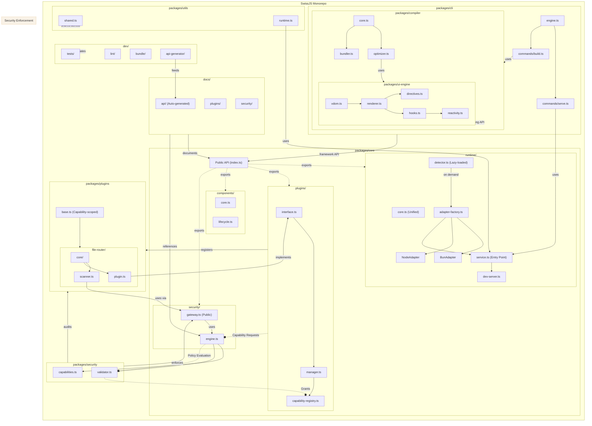
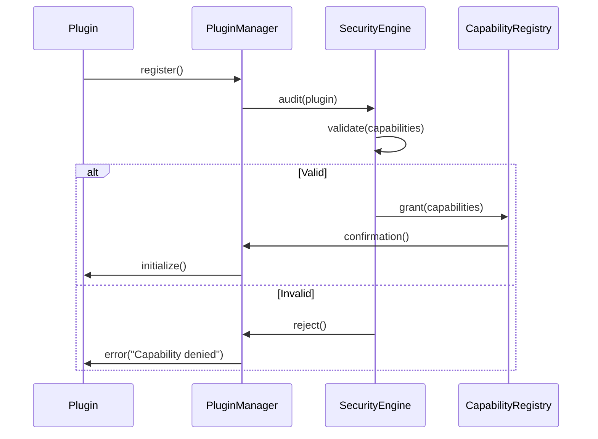
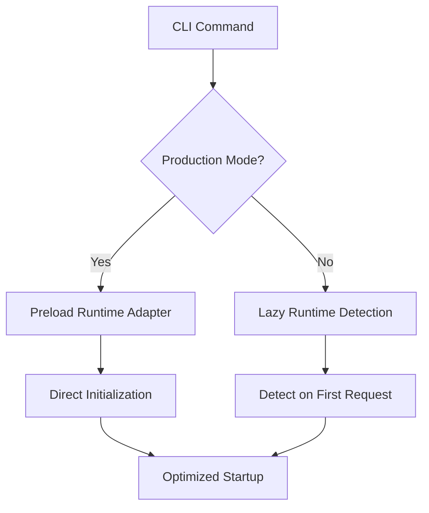

<!--
Copyright (c) 2024 Themba Mzumara
This file is part of SwissJS Framework. All rights reserved.
Licensed under the MIT License. See LICENSE in the project root for license information.
-->

# SwissJS V2: Architecture Redesign

Based on a comprehensive critique of V1, this document outlines the redesigned V2 architecture for SwissJS. It combines the strongest elements from multiple proposals to create a robust, secure, and performant framework.

## High-Level Architecture

The V2 architecture modularizes the framework into distinct, decoupled packages with clear responsibilities and strict API boundaries.

## Key Improvements & Rationale

### 1. Optimized Runtime System
- **Factory Pattern**: Unified adapter creation via `adapter-factory.ts` centralizes runtime-specific logic, making it easier to add new runtimes like Deno.
- **Lazy Detection**: Runtime detection is deferred until absolutely necessary, reducing the framework's startup time, especially in production environments where the runtime is known.
- **Single Entry**: All runtime access is channeled through `runtime-service.ts`, providing a consistent API and preventing direct, untracked calls to runtime-specific functions.
- *Solves*: Runtime overhead, complex relationships, difficult extensibility.

### 2. Capability-Based Security System
- **Explicit Package**: A dedicated `security` package houses the core policy engine, separating security concerns from the main framework logic.
- **Gateway Pattern**: The `core` package exposes only a `PolicyGateway` interface. This prevents plugins or application code from directly manipulating the security engine, enforcing a strict API boundary.
- **Registry**: A central `CapabilityRegistry` tracks granted permissions, providing a single source of truth for security decisions.
- *Solves*: Plugin overreach, security risks, lack of clear permission model.

### 3. Unified UI Engine
- **Dedicated Package**: The VDOM, renderer, directives, hooks, and reactivity system are extracted into a dedicated `ui-engine` package. This clarifies their role and decouples rendering logic from the core framework.
- **Reactivity Integration**: Hooks are designed to leverage the reactivity system directly, creating a more intuitive and efficient state management pattern.
- **Compiler Optimization**: A dedicated `optimizer.ts` in the `compiler` package is responsible for UI-specific optimizations, such as tree-shaking components and static property hoisting.
- *Solves*: Compiler ambiguity, unclear rendering responsibilities.

### 4. Plugin Containment
- **Strict Boundaries**: Plugins can only access framework features through a capability-scoped base, preventing them from accessing unauthorized APIs.
- **Audit Trail**: The security system actively monitors plugin activities, creating an audit trail for diagnostics and security analysis.
- **Explicit Registration**: The `PluginManager` handles all registrations, ensuring that no plugin can execute without first being vetted by the security engine.
- *Solves*: Plugin overreach, security risks, untraceable side-effects.

### 5. Documentation System
- **Auto-Generated API**: The developer tools include an `api-generator` that scans source code to produce up-to-date API documentation automatically.
- **Security Manual**: A dedicated security manual explains the capability model, policies, and best practices for secure plugin development.
- **Live References**: Documentation will explicitly reference code artifacts, ensuring that a change in the code flags the corresponding documentation for review.
- *Solves*: Outdated and non-actionable documentation.

### 6. Utility Consolidation
- **Single Source**: All shared utilities are consolidated into `packages/utils`, eliminating duplication.
- **Runtime-Specific**: Utilities that depend on the runtime environment are isolated in `runtime.ts` and use the `RuntimeService`.
- **Shared Access**: These utilities are designed to be safely used across the entire monorepo.
- *Solves*: Utility duplication and inconsistent implementations.

---

## Critical Security Workflow

This sequence diagram illustrates how a plugin is safely registered and granted capabilities.

---

## Performance Optimization

The runtime system can be initialized differently for development and production to optimize startup performance.

---

## Implementation Roadmap

This V2 migration will be executed in phases to ensure a stable and manageable transition.

| Phase | Focus Area | Key Deliverables |
|-------|------------|------------------|
| **1** | Core Restructuring | • Unified runtime service with factory • Security gateway • Plugin capability registry |
| **2** | UI & Rendering | • Extract `ui-engine` package • Integrate compiler with UI engine • Optimize reactivity system |
| **3** | Security System | • Implement core capability engine • Build policy validator • Create audit subsystem |
| **4** | Dev Experience | • Build API generator tool • Write comprehensive security manual • Set up auto-documentation workflows |
| **5** | Optimization | • Implement runtime lazy-loading • Enable production adapter preloading • Integrate bundle analyzer |

---

This redesigned architecture resolves all identified weaknesses from V1, maintains runtime flexibility, enforces strict security boundaries, optimizes performance, and enables a sustainable and secure plugin ecosystem. 