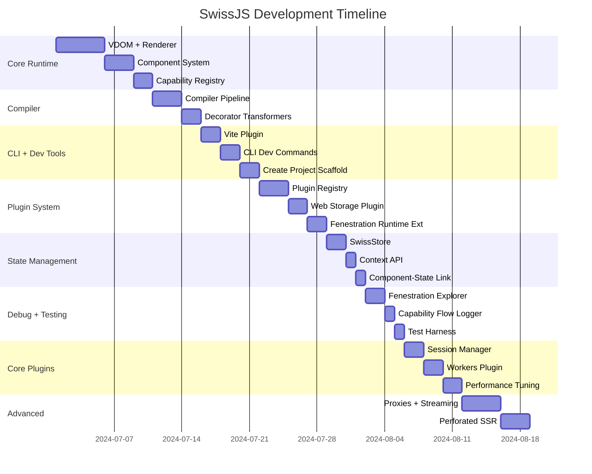

<!--
Copyright (c) 2024 Themba Mzumara
This file is part of SwissJS Framework. All rights reserved.
Licensed under the MIT License. See LICENSE in the project root for license information.
-->

# SwissJS Development Map — Execution Blueprint

## Table of Contents
- [Development Phases with Prioritized Order](#development-phases-with-prioritized-order)
- [Phase 1: Core Runtime & Renderer Foundation](#phase-1-core-runtime--renderer-foundation-days-1-5)
- [Phase 2: Compiler + Decorator Transformation](#phase-2-compiler--decorator-transformation-days-6-10)
- [Phase 3: CLI + Dev Workflow](#phase-3-cli--dev-workflow-days-11-14)
- [Phase 4: Plugin System & Fenestration Expansion](#phase-4-plugin-system--fenestration-expansion-days-15-20)
- [Phase 5: Reactive State Management](#phase-5-reactive-state-management-days-21-24)
- [Phase 6: Debugging Tools + Testing](#phase-6-debugging-tools--testing-days-25-28)
- [Related Docs](#related-docs)

---

[See also: Development Workflow](./development_workflow.md) | [Development Rules](./development_rules.md) | [Jira Workflow Stages](./jira_workflow_stages.md)

---

Perfect. Here's a **consolidated and prioritized development plan for SwissJS**, combining your previous drafts into a streamlined, actionable execution order. This version merges technical depth with realistic milestones and an optimized order of operations.

---

# ✅ **SwissJS Development Plan — Execution Blueprint**

---

## 🎯 **Development Phases with Prioritized Order**

---

## **Phase 1: Core Runtime & Renderer Foundation (Days 1–5)**

> **Goal:** Get the core runtime working with the component system, basic VDOM, renderer, and the fenestration registry.

### 🔥 **Core Focus:**

* No UI = No framework. **VDOM first.**
* Fenestration (capability registry) is baked into the component model from Day 1.

### ✅ **Tasks:**

1. **Virtual DOM System**
   Files:
   `packages/core/src/vdom/vdom.ts` – `createElement()`
   `packages/core/src/vdom/diffing.ts` – basic diff (can start replace-all)
   `packages/core/src/renderer/renderer.ts` – `renderToDOM()`

   Example:

   ```typescript
   export function createElement(type, props, ...children) {
     return { type, props: props || {}, children: children.flat() };
   }
   ```

2. **Component System with Fenestration Core**
   Files:
   `packages/core/src/component/SwissComponent.ts`
   `packages/core/src/capability/manager.ts` – CapabilityManager

   Example:

   ```typescript
   class SwissComponent {
     static requires: string[] = [];
     fenestrate(capability: string, ...args: any[]) {
       return CapabilityManager.resolve(capability)(...args);
     }
   }
   ```

3. **Capability Registry (Fenestration Runtime)**
   Files:
   `core/src/capability/manager.ts`
   Logic:

   ```typescript
   class CapabilityManager {
     register(provider: object, capabilities: string[]) {...}
     resolve(cap: string): Function | null {...}
     validate(requester: object, cap: string): boolean {...}
   }
   ```

---

## **Phase 2: Compiler + Decorator Transformation (Days 6–10)**

> **Goal:** `.1ui` files are transformed into JavaScript with capability metadata injected.

### ✅ **Tasks:**

1. **Compiler Pipeline MVP**
   Files:
   `compiler/src/index.ts`
   `compiler/src/transformers/index.ts`

2. **Decorator Transformer for Capabilities**
   Files:
   `compiler/src/transformers/decorators/capability.ts`
   Converts `@requires`, `@provides`, `@capability` to runtime registration calls.

   Example:

   ```typescript
   function requires(...caps: string[]) {
     return (target: any) => { target.__requiredCapabilities = caps; };
   }
   ```

---

## **Phase 3: CLI + Dev Workflow (Days 11–14)**

> **Goal:** Build `npx swiss dev` that launches a Vite-powered dev server with .1ui support.

### ✅ **Tasks:**

1. **Vite Plugin (`vite-plugin-swiss`)**
   Files:
   `packages/plugins/vite-plugin-swiss/src/index.ts`
   Handles `.1ui` file transform via compiler.

2. **CLI Development**
   Files:
   `cli/src/index.ts`
   Commands:

   * `swiss dev`
   * `swiss build`
   * `swiss create`

3. **Test Project Scaffold**
   Files:
   `cli/src/create.ts` – Generates starter projects with example `.1ui` files.

---

## **Phase 4: Plugin System & Fenestration Expansion (Days 15–20)**

> **Goal:** Implement dynamic plugins, capability resolution, and cross-component/service communication.

### ✅ **Tasks:**

1. **Plugin Registry**
   Files:
   `core/src/plugin/registry.ts`
   `core/src/plugin/resolver.ts`

   ```typescript
   class PluginRegistry {
     register(name: string, plugin: Plugin) {...}
     getService(capability: string) {...}
   }
   ```

2. **First Plugin: Web Storage**
   Files:
   `plugins/web_storage/src/index.ts`
   Provides: `storage:read`, `storage:write`

3. **Fenestration Runtime Expansion**

   * Support `FenestrationPortal`
   * Add `FenestrationProxy` (basic version)

---

## **Phase 5: Reactive State Management (Days 21–24)**

> **Goal:** Enable observable state containers and link state changes to component re-renders.

### ✅ **Tasks:**

1. **SwissStore (Reactive State)**
   Files:
   `core/src/reactive/reactive.ts`

   Example:

   ```typescript
   class SwissStore<T> {...}
   ```

2. **Context API**
   Files:
   `core/src/reactive/context.ts`
   Enables scoped state/context provisioning.

3. **Component-State Wiring**
   Link SwissStore to `setState()` and automatic rerenders.

---

## **Phase 6: Debugging Tools + Testing (Days 25–28)**

> **Goal:** Implement basic devtools and test harness.

### ✅ **Tasks:**

1. **Fenestration Explorer**
   Visualizes:

   * Capability tree
   * Active fenestration calls

2. **Capability Flow Logger**
   Console Output:

   ```bash
   [FENESTRATION] cart:add → inventory:check (4.2ms)
   └─ SECURITY: tenant-scope:acme-corp
   ```

3. **Test Harness**
   Files:
   `testing/src/index.ts`
   Mocks fenestration calls.

---

## **Phase 7: Core Plugins + Performance Tuning (Days 29–34)**

> **Goal:** Expand practical capabilities with essential plugins.

### ✅ **Core Plugins:**

* `session_manager`
* `web_storage`
* `workers` (for cross-runtime fenestration)

### ✅ **Performance Enhancements:**

* Diffing algorithm optimization
* Component instance pooling
* Lazy plugin loading

---

## **Phase 8: Advanced Features (Beyond Day 35)**

### 🚀 **Next-Level Capabilities:**

* **Fenestration Proxies:** Cross-runtime, cross-worker capability calls.
* **Fenestration Streaming:**

  ```typescript
  const stockStream = fenestrateStream('inventory:updates');
  ```
* **Perforated SSR:** Partial hydration.
* **AI-Driven Capability Optimization:** Auto-bundle capabilities based on usage.

---

## 🏗 **Gantt Chart Development Timeline**



---

## 🚀 **Execution Summary**

### 🔥 **Critical Path First:**

1. VDOM → Component → Capability Manager → Renderer
2. Compiler + Decorators
3. CLI + Dev + Vite

### 🧠 **Parallelizable:**

* State management and plugin system can run in parallel post-Phase 3.
* Debugging tools and test harness slide in concurrently with plugin development.

### ✅ **Dev Principle:**

* **"Test something working every 2–3 days."** Never wait for perfect; iterate visibly.

---

## ✅ **Next Action:**

If you want, I can generate:

* ✅ Code scaffolding for Phase 1
* ✅ File structure as `.md` or `.tree`
* ✅ Task checklists or Kanban board templates

### 🔥 Ready to proceed?

## Related Docs
- [Development Workflow](./development_workflow.md)
- [Development Rules](./development_rules.md)
- [Jira Workflow Stages](./jira_workflow_stages.md)
